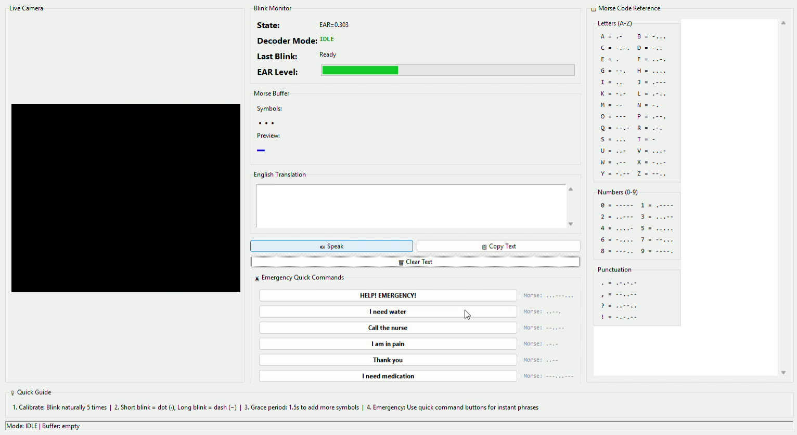

# 👁️ Blink2Speech

Blink2Speech is a real-time assistive communication system that detects eye blinks using computer vision, translates them into Morse code, and converts them into readable text and synthesized speech.

Designed to support individuals with paralysis, ALS, or motor impairments, the system enables hands-free communication using just eye movements.

---

## 🚀 Features

* 👁️ Real-time eye blink detection using MediaPipe
* 🔤 Morse code translation (short & long blinks)
* 🧠 Blink classification with calibrated thresholds
* 🗣️ Text-to-Speech output for communication
* 🖥️ Interactive GUI with live camera feed
* ⚡ Emergency quick-command support

---

## 🛠️ Tech Stack

* Python
* OpenCV
* MediaPipe
* Tkinter
* pyttsx3 (Text-to-Speech)

---

## ⚙️ How It Works

1. Captures live video using webcam
2. Detects facial landmarks using MediaPipe
3. Tracks eye aspect ratio to identify blinks
4. Classifies blinks into:

   * Short blink → dot (.)
   * Long blink → dash (-)
5. Converts Morse code → text
6. Outputs text via speech

---

## 📊 Use Case

This system is designed for:

* People with **paralysis or ALS**
* Users with **limited motor abilities**
* Assistive communication in healthcare settings

---

## 📷 Demo / Preview



---

## 🔧 Setup Instructions

```bash
git clone https://github.com/rabbanikhalid/Blink2Speech
cd Blink2Speech
pip install -r requirements.txt
python main.py
```

---

## 💡 Future Improvements

* Add customizable blink sensitivity
* Support multiple languages for speech
* Improve accuracy with advanced ML models
* Deploy as a lightweight desktop/mobile app

---


## 📬 Contact

* 💼 LinkedIn: https://linkedin.com/in/khalid-rabbani
* 📧 Email: [khalidrabbani06@gmail.com](mailto:khalidrabbani06@gmail.com)

